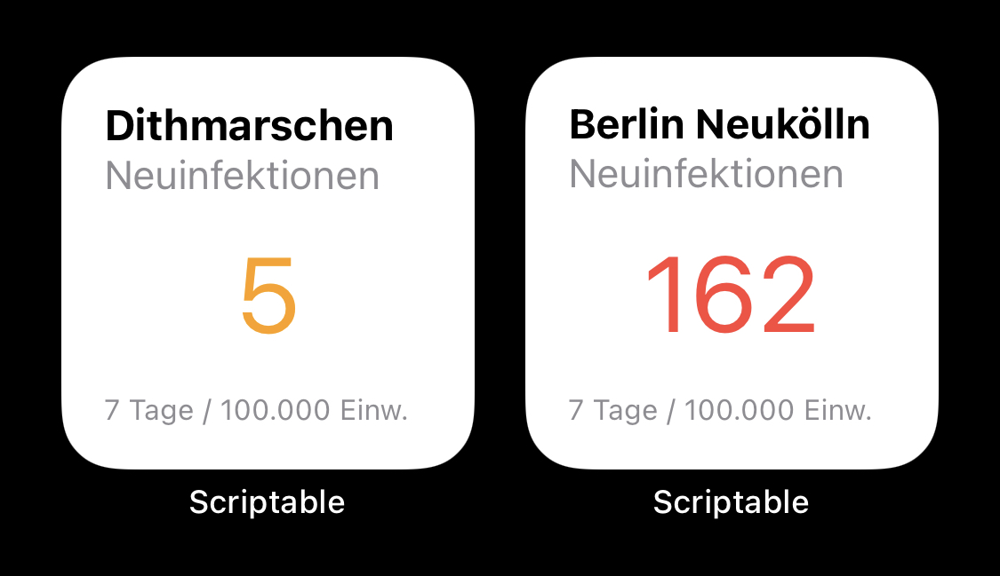

# scriptable-COVIDget

Display the number of new infections in your district in the last seven days per 100k population in an iOS 14 widget.
This is the alternative to [COVIDget](https://github.com/bahlo/COVIDget).

## Install

1. Download [Scriptable](https://apps.apple.com/de/app/scriptable/id1405459188) (free)
2. Start scriptable and copy the contents of `COVIDget.js` into a new script 
3. Get the ID of your district [here](https://bahlo.github.io/scriptable-COVIDget)
4. Add a small Scriptable widget to your Homescreen
5. Hold the widget and configure it to use the script your created earlier and put the ID of your district as parameter
